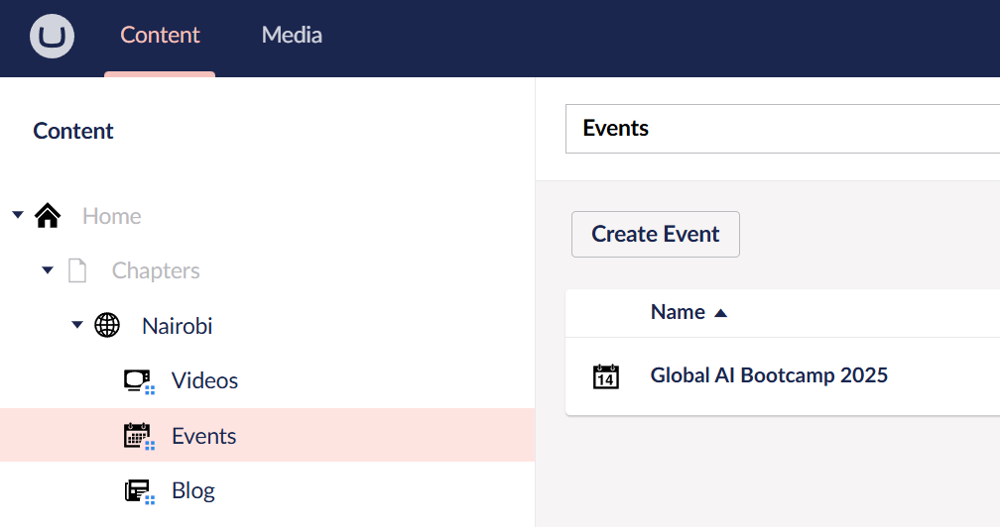
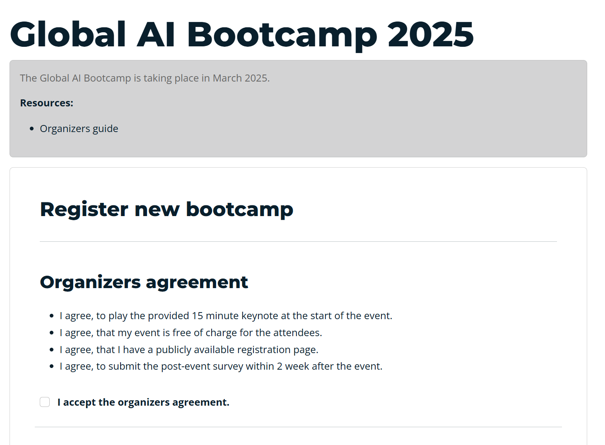

# How to organize

Thank you for investing your time into the wonderfull tech community! We are looking forward to help you in organizing your local Global AI Bootcamp in 2025.

# Some basics

**What is the Global AI Bootcamp?**

The Global AI Bootcamp is an annual event organized by local communites, where developers and AI enthusiasts from around the world come together to learn about artificial intelligence through workshops, sessions, and interactive discussions. This event is hosted in various locations globally, providing a platform for participants to delve into AI technologies, network with like-minded individuals, and gain hands-on experience with the latest AI tools and techniques. The bootcamp aims to foster a collaborative learning environment and promote the growth of AI knowledge and skills within the community.

**How does the agenda need to look like?**

That is totally up to you! Except 1 thing, we request each event to play our pre-recorded [keynote](04-keynote.md). All the rest of the agenda is up to your choice and the needs of your community. We noticed some communities focused on workshops others on sharing sessions.

**Do you offer any content that we can re-use**

Yes we do, we are working hard on collecting different [slide decks](05-presentations.md) and [workshops](06-workshops.md) that you can reuse at your event. 

*Do you have a slide deck or a workshop that you want to share with the community? (Reach out to hq@globalai.community)*

**Is there any artwork that we can use?**

Offcourse! If you are an official Global AI Chapter, then you can find all your artwork back on your [chapter dashboard](https://globalai.community/umbraco#/content). If you are local community organizer, then you can find all artwork back [here](03-artwork.md)

**Are we allowed to charge a fee to the attendees?**

Yes, but only to cover your costs. The Global AI Community is a non-profit to help people to learn more about AI, we make no profit and we request the same from our local chapters. It is allowed though to ask for a minimum fee to cover the cost of catering and/or venue costs.

**Does the event need to be in-person?**

No, it can be virtual, hybrid or in-person. But let's be honest! In person events are the best! Isn'it?


# Register 

## As an official *Global AI Chapter Lead*
Go to your [Chapter Dashboard](https://globalai.community/umbraco#/content). Click on 'Events' and create a new one.
Fill in all the details, and thats it!



## As a community leader
Are you already registered as a Global AI Community member? (You are able to login on our website)
Then you can immediatly register your event on your [dashboard](https://globalai.community/dashboard/global-ai-bootcamp-2025/)



## You are totally new?
Then lets first make the decision if you want to be an *associate* or a *chapter*.

What is the difference?

An associate is an existing community that also want to organize our bootcamps, every one is welcome you know!

Becoming a chapter gives you a bunch of benefits. You get custom badges, access to our Meetup Pro account, StreamYard, Socials and so many more.

*You can read more about it [here](https://globalai.community/about/start-a-chapter/)*

**Want to become a chapter lead?**
Follow the steps that you find [here](https://globalai.community/about/start-a-chapter/)*

If you want to **organize** the bootcamp **with your own community**, then signup on our website, register your community and you can register your own Global AI Bootcamp.


```note 
Are you still missing any info? Don't hesitate to let us know via hq@globalai.community
```