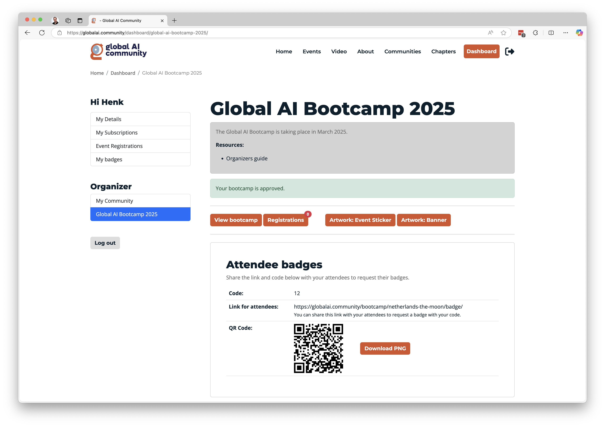

# Digital attendee badges

To reward your attendees for attending your event you can award them with a Digital Badge the attendees can share on socials.

**If you are an [official chapter](https://globalai.community/chapters/) please follow the Guidance for badges on [docs.globalai.community/](https://docs.globalai.community/)**

### How to share the badge with your attendees?

- Login to your [dashboard](https://globalai.community/dashboard/global-ai-bootcamp-2025/) 
- Navigate to the [Global AI Bootcamp](https://globalai.community/dashboard/global-ai-bootcamp-2025/).
- Share the link, QR code and the code with your attendees at the end of the event.

